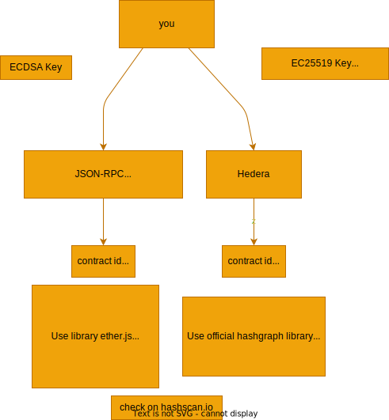

# Setup
1. Create a new type of key in hedera for ethereum compatibility
https://portal.hedera.com/dashboard
 create ECDSA key for compatibility

# Some Details




# Create a new contract and run
1. Create your contract in contract folder
2. Since your contract will have different constructor parameters and functions to call you need to create a new file in the scripts folder
3. Choose how you want to deploy and call the contract a. hedera native b. ethereum compatibility layer
e.g. If you want hedera native duplicate the two files named _hedera in the scripts/ folder
4. Modify the scripts according to your new contract constructor and function calls
5. Create a new `.env` file by duplicating `.env.example`

# Deploy the contract
For hedera style
```bash
npx hardhat compile
npx hardhat run scripts/hedera/deployContract_new_hedera.js
```

get the contract id and place it in the .env file

# Call the contract
For hedera style
```bash
npx hardhat run scripts/hedera/callContract_new_hedera.js
```
